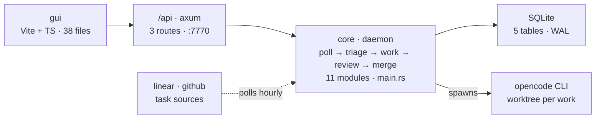

# Components

**Five pieces, one binary. The daemon owns the loop; the GUI is a thin view over the same SQLite file the daemon writes.**

## The pieces

The GUI is 38 Vite + TypeScript files and nothing else — no business logic, just a view. It talks to three axum routes on :7770, and both are served by the core binary. The daemon itself is 11 modules under main.rs: poller, triage, worker, review, merge. Every attempt runs through the opencode CLI in its own worktree, and task sources — linear and github — are polled hourly.

Under it all, one SQLite file in WAL mode holds projects, sources, tasks, works, and reviews. The GUI never touches the network for data; it reads the same rows the daemon writes.

*Fig. 1 — five pieces, one binary · node size follows lines of code.*

## Where the code lives

The daemon's 11 modules live under core/src/main.rs: the poller that watches sources, triage that orders the queue, the worker that runs attempts, and the review gate before merge. Persistence and migration sit in core/src/db.rs; the daemon speaks to the outside world through core/src/ipc.rs.

The GUI is 38 files under gui/src — routing in router.tsx, one page per project tab. It never imports core; the only shared language is the database schema.

## The single-file contract

SQLite in WAL mode is the integration point, not an implementation detail. The daemon writes projects, sources, tasks, works, and reviews; the GUI reads the same rows. The schema in db.rs is the contract every agent codes against — change a table and both sides move.

One binary serves the GUI and the API on local loopback :7770. No remote hosting, no multi-user sync: the architecture assumes a single operator and their worktrees, and spends its complexity budget on the loop instead.

## Poll, watch, and cursors

Two cron schedules drive the daemon: the poller asks Linear and GitHub for new work hourly, and the watcher sweeps worktrees every two minutes for finished attempts. Each source keeps its own cursor — linear team ENG at 08f3, the github repo at 91bd — so a restart resumes the feed instead of refetching the world.

Sources toggle per project, and a dead source is loud: the project row carries the error inline, SSH key rejected and all, with nothing attached until it is fixed. Backoff state rides in task metadata for the same reason cursors do — memory forgets, rows do not.

## Worktrees and transcripts

Every attempt gets an isolated worktree — wt-auth-fix for work #128 — so the main checkout never sees half-finished code. The agent is the opencode CLI, and everything it does lands in a transcript: reads, edits, test runs, failures. The GUI tails the same log file the daemon wrote; log_path is a first-class column, not an afterthought.

Attempts are cheap and numbered. Work #128 was the second try at LIN-142; #121 failed first on the 401 that taught the backoff lesson. Exit codes decide the row color — 0 green, anything else red — and a running work shows a live tail with no exit at all.

## Failure shapes

Each piece fails in its own way and says so inline. A project that cannot clone carries the SSH error on its row. A task whose token refresh loops gets marked blocked with the provider error attached. A work that exits nonzero keeps its transcript for the postmortem.

Review is the last gate: PR #412 came back with two comments and changes wanted, and the work went around again instead of merging red. Nothing in the loop promotes itself — human sign-off is the only merge path that counts.

## One binary, no cycles

Node size follows lines of code, which is why the daemon node dominates: the loop, the worker, and the review logic all live in core. A red halo would mark a dependency cycle; there are none. The arrows all point one way — interface to daemon to store, with the CLI spawned outward and sources polled inward.

## Related

- [Runtime →](runtime.md)
- [Data model →](data-model.md)
- 11 modules · main.rs
