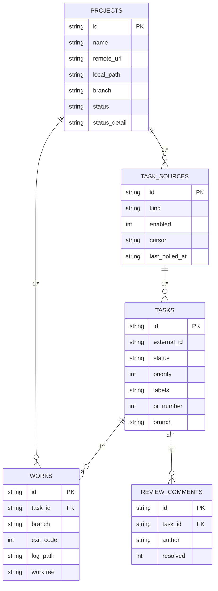

# Data model

**Five tables, one root: tasks. Projects own sources and works; sources feed tasks; works execute them; reviews discuss them.**

## Ownership

Foreign keys enforce what the UI assumes: a work or a review cannot exist without its task. Delete a task and its works and reviews go with it. Projects carry the checkout — name, remote_url, local_path, branch — plus a status with a human-readable detail string, so a failed clone reads as an SSH error on the row instead of a missing directory.

Sources carry kind (linear|github), an enabled flag, a poll cursor, and last_polled_at. The cursor is what makes polling incremental: team ENG at 08f3, the github repo at 91bd.

## The task row

Tasks carry external_id (LIN-142), one of nine statuses, a priority, a label set, and the branch and PR number once work starts. Priority drives the triage queue — P0 first — and labels slice it ([auth] [bug]).

Backoff columns (backoff_until, backoff_count) arrived additively with defaults in ADR-041: existing rows never noticed, and the delay now survives repolls and restarts.

*Fig. 1 — five tables · everything hangs off tasks.*

## Works and reviews

A work is one attempt: task_id back to its task, the branch it ran on, exit_code for the row color, log_path for the tail, worktree for the isolation. Numbered attempts make failure cheap — #128 was the second try at LIN-142. A review comment is task_id plus author plus a resolved flag; open ones gate the merge, resolved ones are history.

## Migrations

Schema changes are additive with defaults (backoff columns) plus targeted indexes (idx_tasks_status for the triage queue). Migrate runs at startup; old rows never break.
