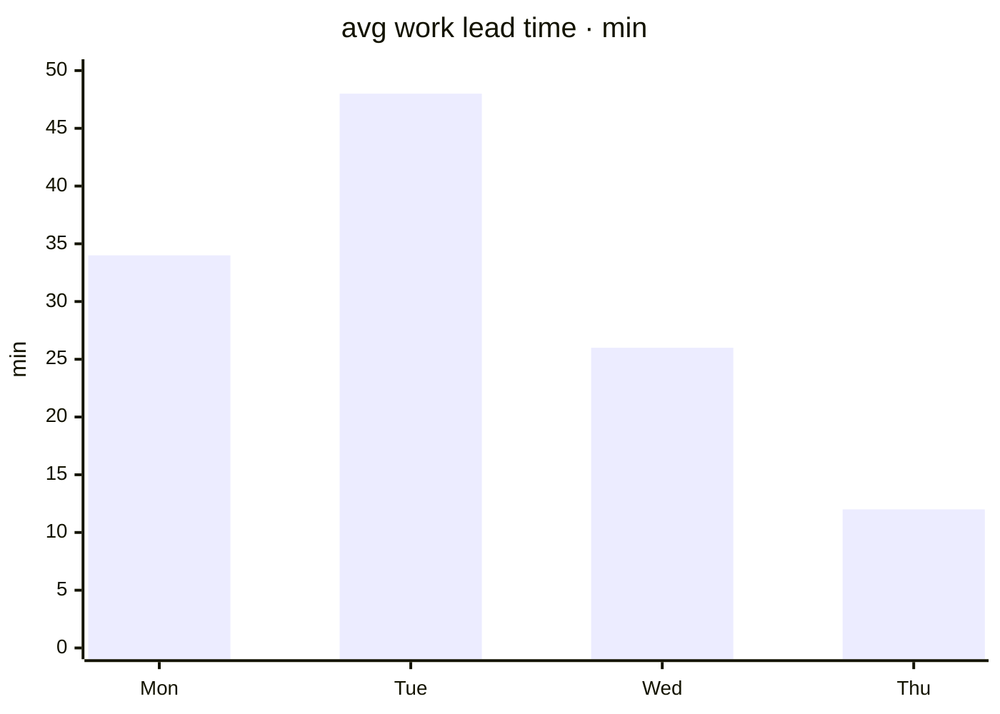

# Health

**Lead time is falling as backoff fixes land — Thursday's median is a quarter of Tuesday's. Anything in the top-right of churn × complexity (currently poller.rs) gets mandatory human review before merge, no matter how green the tests are.**

## The trend

Average work lead time by weekday: Monday 34m, Tuesday 48m, Wednesday 26m, Thursday 12m and falling. The drop tracks the backoff work landing — attempts stop dying on 401s and stop restarting cold, so the median collapses. Lead time comes from works.started_at / finished_at, so it measures the loop, not estimates.

*Fig. 1 — avg work lead time in minutes · Mon 34 · Tue 48 · Wed 26 · Thu 12.*

## Hotspots

Churn × complexity, weekly from git log against works:

- src/poller.rs — 14 works · complexity 18 · mandatory human review
- core/src/db.rs — 6 works · complexity 9
- gui/src/pages/project — 11 works · complexity 6

Top-right placement earns review regardless of test color. Poller.rs sits there because every reliability fix lands in the loop first.

## Cadence

Recomputed weekly from git history and finished works. A file that stops churning drops off; a file that climbs into the top-right gets flagged before it merges, not after.
