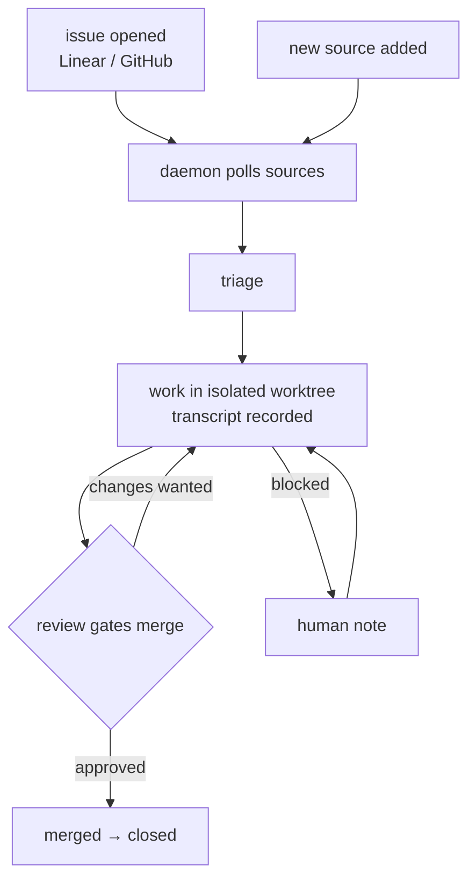

# Overview

**formless-hands turns Linear and GitHub issues into merged code with almost no human typing.**

A daemon polls task sources on a cron, triages what it finds, and hands work to opencode agents running in isolated git worktrees. Every attempt is a recorded work with a transcript; reviews gate the merge. The GUI and API are served by the same binary over SQLite — one file holds projects, sources, tasks, works, and reviews.

## Scenarios

- issue → merged PR
- blocked → human note → retry
- new source → first poll

## Sections

- [Components](components.md) — flowchart · from cargo tree + imports
- [Data model](data-model.md) — ER diagram · from DDL · live counts
- [Runtime](runtime.md) — sequence · from daemon loop · exemplar work #128
- [Health](health.md) — lead time + hotspots · from git + works · weekly
- [Decisions](adrs/) — ADRs · ADR-041 accepted · ADR-040 proposed

## Component summaries

**Components.** Five pieces, one binary. The daemon owns the loop; the GUI is a thin view over the same SQLite file the daemon writes. Node size follows lines of code — the daemon node dominates because the loop, worker, and review logic all live in core. A red halo would mark a dependency cycle; there are none. Deep-dive in [components.md](components.md). Refs → core/src/main.rs · core/src/poller.rs · core/src/ipc.rs · gui/src/router.tsx · Cargo.toml.

**Data model.** The whole system is five tables. Everything hangs off tasks: sources feed them, works execute them, reviews discuss them. Foreign keys enforce ownership — a work or review cannot exist without its task. Counts are live; the schema is the contract agents code against. Deep-dive in [data-model.md](data-model.md). Refs → core/src/db.rs (DDL + migrate) · core/src/models.rs (Task · TaskSource · Project).

**Runtime.** One issue's journey through the loop, with real timestamps from work #128. The dotted return from the forge is the only async edge — review comments arrive on their own schedule and can send a work back. Green path to closed is the common case; red here cost one extra attempt. Deep-dive in [runtime.md](runtime.md). Refs → core/src/main.rs · core/src/worker.rs · core/src/poller.rs · core/src/watcher.rs · work #128 transcript.

**Health.** Lead time is falling as backoff fixes land — Thursday's median is a quarter of Tuesday's. Anything in the top-right of churn × complexity (currently poller.rs) gets mandatory human review before merge, no matter how green the tests are. Deep-dive in [health.md](health.md). Refs → git log · works.started_at / finished_at · rust-code-analysis.

**Decisions.** ADR-041 · backoff state lives in task metadata · accepted — survives repolls and worker restarts; alternative (in-memory delay) lost state on every crash. Touches poller · db. From work #128 · LIN-142. ADR-040 · single refresh helper in auth.rs · proposed — one path for token refresh removes the inline retry that caused the loop. Awaiting human sign-off. From work #121 · LIN-142. Full records in [adrs/](adrs/).
