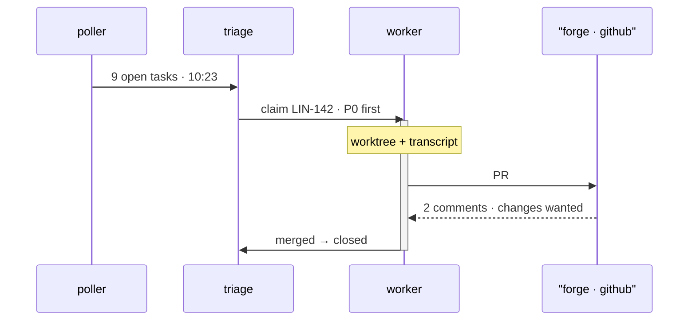

# Runtime

**The runtime is one daemon loop — poll, triage, work, review, merge — running inside the same binary that serves this page. What follows traces a single issue, LIN-142, through the full loop using the real transcript of work #128.**

## The loop

Every hour the poller asks Linear and GitHub what is new. At 10:23 it emitted nine open tasks; triage ordered them by priority, P0 first, and claimed LIN-142 — a tight auth-refresh loop flooding the poller logs. The claim created work #128: an isolated worktree at wt-auth-fix with its own transcript, so the main checkout never sees half-finished code.

The worker reads, edits, and tests inside the worktree. By 10:31 it had opened PR #412 — and here the loop turns asynchronous. The forge answers on its own schedule: two review comments sent the work back for changes before it merged and closed. Nothing passes review without approval; that gate is the whole point.

*Fig. 1 — one issue through the loop · timestamps from work #128.*

## Exemplar trace · work #128

- 10:23 — 9 open tasks polled · LIN-142 claimed P0 first
- 10:24 — worktree wt-auth-fix · transcript starts
- 10:26 — attempt 1 FAILED · 401, no backoff state written
- 10:27 — delay persisted in task metadata
- 10:28 — 14 tests pass · backoff holds across polls
- 10:31 — PR #412 · 2 comments → changes wanted → merged → closed

## State, backoff and retry

Backoff state lives in task metadata, not in memory. Two columns on tasks — backoff_until and backoff_count — added additively with defaults, so existing rows migrate untouched. The next run resumes the delay instead of starting cold: no more than one refresh per minute per source.

The triage queue leans on a status index, so list_tasks stops scanning on large DBs. Claims stay P0-first; a blocked task waits for a human note, then retries from where it stalled.

## One path for token refresh

Auth refresh had two paths: the canonical refresh and an inline retry in auth.rs that fired immediately on failure — the mechanism of the loop. Work #121 collapsed them into refresh_once(), replacing retry_inline(). Proposed in ADR-040, awaiting human sign-off.

The dotted return from the forge is the only async edge — review comments arrive on their own schedule and can send a work back.

Attempt 1 died on a 401: refresh token expired, worker exited before writing backoff state. Fixed per ADR-041, covered by backoff_resets_across_polls.

## Related

- ADR-041 accepted
- ADR-040 proposed
- [LIN-142 →](https://linear.app) · work #128
